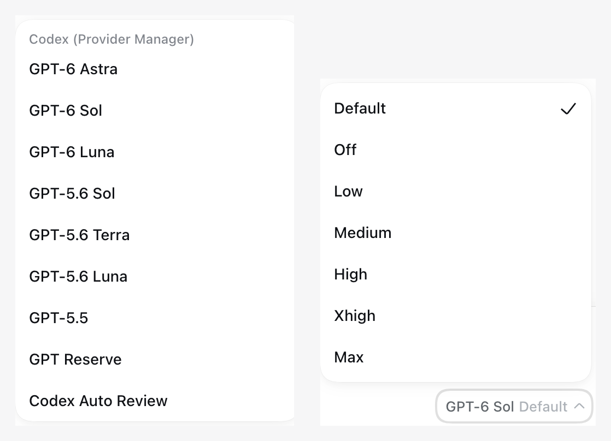
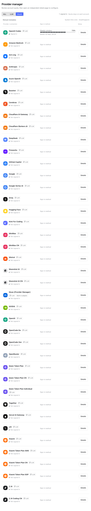
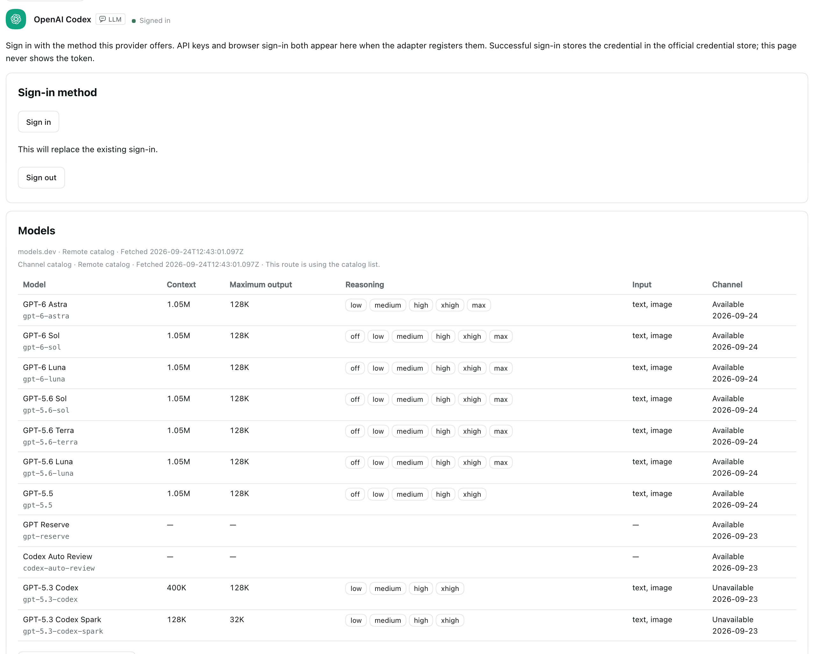

# dsh-provider-manager

**Every provider, one page.**

English | [中文](README.zh.md)


[](https://github.com/deepseek-ai/deepseek-harness)
[](LICENSE)

Your models come from a dozen places — a Codex subscription, Claude Pro, an OpenCode Go plan, an OpenRouter account, maybe your own gateway. Until now, each of those meant its own setup: paste a key somewhere, edit a YAML file, wonder why the model picker shows a model that stopped existing months ago.

This page ends that. **Sign in or paste a key once — you see what's left of your quota, and your models appear in the picker by themselves: right names, real context windows, effort levels that work.** Everything lives in one Settings page, in the official stores DSH already uses.

Works with **DSH `0.1.5-rc.2`**. Current release: **v0.4.0**.

## If your provider needs a sign-in

Sign in with the account you already pay for — Codex, Claude, Kimi, xAI, GitHub Copilot, OpenRouter, or any other provider with a login (39 of them on a stock install), plus Muse via device code.

| | |
| --- | --- |
| **Signing in** | The standard OAuth / device-code flow, in the page, working out of the box |
| **Right after** | Your provider's models appear in the picker with their real context windows, output limits, proper display names, and the effort levels the channel actually supports (`off / low / medium / high / xhigh / max`). Dead models don't show up |
| **The card** | Brand mark, which account is signed in, how much quota you have left (60-min auto refresh + a manual button, wherever the provider exposes an endpoint), one-click logout |
| **Browsing** | **ALL \| LLM \| OAuth** tabs; your credentials go to the official DSH store and are never displayed back |

### Why you can trust the model list

When you sign in, the plugin quietly checks each model against the provider — a tiny request, at most eight at a time, at most once a day per model — and reads which model actually answered. If a provider quietly retires or swaps a model, the check catches it; what's unproven simply stays out of your picker. Sizes and prices are cross-checked against [models.dev](https://models.dev), and live availability data ships from a community registry ([dsh-provider-models](https://github.com/KEVINCHEN625/dsh-provider-models)) that updates without plugin releases. OpenRouter's four hundred models stay browsable with a curated shortlist plus search-and-add.

## If your provider uses an API key

- **OpenCode Go, built in.** No extra plugin to install. The connection serves the official Go catalog — 41 models, each talking the protocol it actually needs, including Muse Spark 1.3 with `max`. [Setup, limits, rollback](docs/opencode-integrated.md) · [Catalog evidence](docs/opencode-all-models-evidence.md)
- **Command Code GOAT** — manage the key and watch the official quota; chat runs on the [Command Code provider plugin](https://github.com/Mars-Sea/dsh-commandcode-provider).
- **Honest numbers only.** OpenCode Go and Command Code read the providers' own usage endpoints. Anything custom shows **unsupported** rather than a made-up progress bar.
- **16 presets, one card each.** **ZCode** (GLM Coding Plan), **MiMo** (Xiaomi Token Plan), **MiniMax** — each with China / Overseas endpoints on one card — plus **OpenRouter, SiliconFlow, Moonshot, DeepSeek, OpenAI, Anthropic, Groq, Together, Fireworks, DashScope, Google Gemini, Mistral**, and one-click **Meta Model API**. OpenRouter is on both sides of this page: API key here, sign-in above.
- **Anything else becomes a custom route.** Any OpenAI-Completions, OpenAI-Responses, or Anthropic-Messages endpoint, named and managed like a built-in — and it can never collide with the reserved ones.
- **1M context, per model.** A checkbox on every model, pre-filled to the official size. Change it before you save.

## Screenshots

Sign in once — the models are already waiting in your picker:



The page itself — **Settings → Provider manager**, every provider on one list:


The OAuth tab — Codex signed in, the rest waiting behind their own marks:



What a signed-in provider looks like in detail — real names, real windows, effort levels, and the retired ones marked unavailable:



OpenCode Go — the key stays masked; quota windows straight from the provider:


Muse — sign in with a device code when you're ready:


One-click Meta Model API draft (`openai-responses` at `https://api.meta.ai/v1`):


## Install

This package declares `dsh.bundle`, so `dsh plugin add` activates a settings layer. Official notes: [Package and install a plugin](https://deepseek-harness.github.io/deepseek-harness/en/develop/basic/publish).

Install the **release tarball** (it already contains `lib/`). We do not ship a `prepare` script, so `github:KEVINCHEN625/dsh-provider-manager` will not compile on install — this plugin handles credentials and should not require `allowBuilds`.

```sh
dsh plugin --profile web add --ignore-scripts --force \
  https://github.com/KEVINCHEN625/dsh-provider-manager/releases/download/v0.4.0/dsh-provider-manager-0.4.0-664a895a3f1b.tgz
dsh --profile web --dump-config   # look for "# == dsh-provider-manager"
dsh web
```

Then open **Settings → Provider manager**. Check [Releases](https://github.com/KEVINCHEN625/dsh-provider-manager/releases) for the latest tarball and swap the URL.

If the web profile is itself a pnpm workspace (`packages: [.]`), pass pnpm's boolean `--workspace-root` **before** the tarball:

```sh
dsh plugin --profile web add --workspace-root --ignore-scripts --force \
  ./dsh-provider-manager-0.4.0-664a895a3f1b.tgz
```

After installing, restart Web and open Settings — the page is there.

### DSH Desktop

[DSH Desktop](https://github.com/anywhere-labs/dsh-desktop) (v2.0.14+, bundling dsh 0.1.7-rc.1) works with this plugin as of 0.4.1. Open **Open DSH Terminal** from the tray and run the same `dsh plugin add` command, then restart the app. Desktop keeps its own dsh home, so credentials and routes are managed per installation. Full walkthrough: [docs/desktop-walkthrough.md](docs/desktop-walkthrough.md). Note: the first Desktop launch imports `~/.dsh/settings.yaml` into its own profile and renames the original to `.imported` — CLI/Web users should copy it back (one command, see the walkthrough).

### Which adapter runs the chat

| Provider | Chat runs on |
| --- | --- |
| OpenCode Go / Spark | **Built in** — `provider-manager-opencode-go`, no third-party plugin required |
| Muse | **Built in** — `provider-manager-muse` after a device-code sign-in (5 models; only Spark 1.3 carries `max`) |
| Command Code GOAT | [Command Code provider plugin](https://github.com/Mars-Sea/dsh-commandcode-provider) |
| Sign-in providers (Codex, Claude, …) | The harness `llm-pi-ai` route named after the provider |
| Custom gateways | The `llm-pi-ai` custom route you created |

## Using the page

The list shows brand mark, name, LLM/Agent badge, key status, remaining quota, and a Details page for each card.

**OpenCode Go** — key ref `OPENCODE_API_KEY`. Quota from the official usage endpoint.

**Command Code GOAT** — key ref `COMMANDCODE_API_KEY`. If a literal key, an extra account, or `auth.json` takes precedence in your setup, the card says **source-unverified** instead of guessing.

**Custom API** — pick a preset or start from scratch. ZCode, MiMo, MiniMax, SiliconFlow, and Moonshot keep China / Overseas on one card; the key must match the console that issued it.

| Preset | Notes |
| --- | --- |
| **ZCode** | GLM Coding Plan (`glm-5.3-flash`, `glm-5.3`). China `https://open.bigmodel.cn/api/coding/paas/v4`, Overseas `https://api.z.ai/api/coding/paas/v4`. Anthropic Messages uses `/api/anthropic`. Do **not** use `/api/paas/v4`. |
| **MiMo** | Xiaomi Token Plan (`tp-` keys, not pay-as-you-go `sk-`). China `https://token-plan-cn.xiaomimimo.com/v1`, Overseas Singapore `https://token-plan-sgp.xiaomimimo.com/v1`. Europe cluster is `token-plan-ams` — paste it if that is what the Token Plan page shows. |
| **MiniMax** | China `https://api.minimax.cn/v1`, Overseas `https://api.minimax.io/v1`. Anthropic uses `/anthropic` on the same card. |
| **OpenRouter** | `https://openrouter.ai/api/v1` |
| SiliconFlow / Moonshot | China and Overseas URLs on the same card |
| DeepSeek, OpenAI, Anthropic, Groq, Together, Fireworks, DashScope, Google Gemini, Mistral, Meta Model API | Official base URL prefilled |

Save the configuration, then save the key. Each model row has the **1M context** checkbox; the env name is derived from the route (`DSH_PROVIDER_MANAGER_<hex(route)>_API_KEY`). Reserved routes: `opencode-go`, `commandcode`, `deepseek-official`, `cliproxy`, `muse-code`, `provider-manager-opencode-go`, `provider-manager-muse`.

## Security

- Keys and tokens never leave the host process; snapshots and logs never contain them.
- Showing a key requires an authenticated request from a **real loopback socket** — proxies, tunnels, and `Origin: null` are rejected — and the value clears on hide, blur, connection change, or after 30 seconds.
- Quota queries and model checks talk only to the providers' official endpoints, never carry output caps, and run at most once per model per 24 hours.

Using a remote browser? SSH-forward to `127.0.0.1` to save settings or reveal a key.

## What's next

1. **More channel data** — every provider's verified model list grows as its users sign in.
2. **Key health check on save** — a fresh key gets tested before you trust the card.
3. **Multi-account** — key pools with rotation, where plans allow.
4. **More quota adapters** — the same official-quota treatment for the sign-in families.

## Uninstall

```sh
dsh plugin --profile web remove dsh-provider-manager
dsh web
```

This removes the plugin's built-in `provider-manager-opencode-go` and `provider-manager-muse` connections. Your credentials, custom routes, and other provider plugins stay.

## Develop

```sh
pnpm install --frozen-lockfile
pnpm typecheck && pnpm test && pnpm test:client
pnpm build && pnpm check:pack
```

Design docs, deployment evidence, and the review trail live in [`docs/`](docs/).

## Trademarks

Brand marks on the cards come from [simple-icons](https://simpleicons.org) where that library has one. OpenAI, Groq, Amazon Bedrock, Azure, Cerebras, Fireworks, Together, Baseten, Z.ai, Ant Group, and Pi are the vendors' own published marks, embedded the same way. Each mark is a trademark of its owner and is shown only to identify the provider. A provider with no mark keeps the letter badge.

## License

[MIT](LICENSE)
