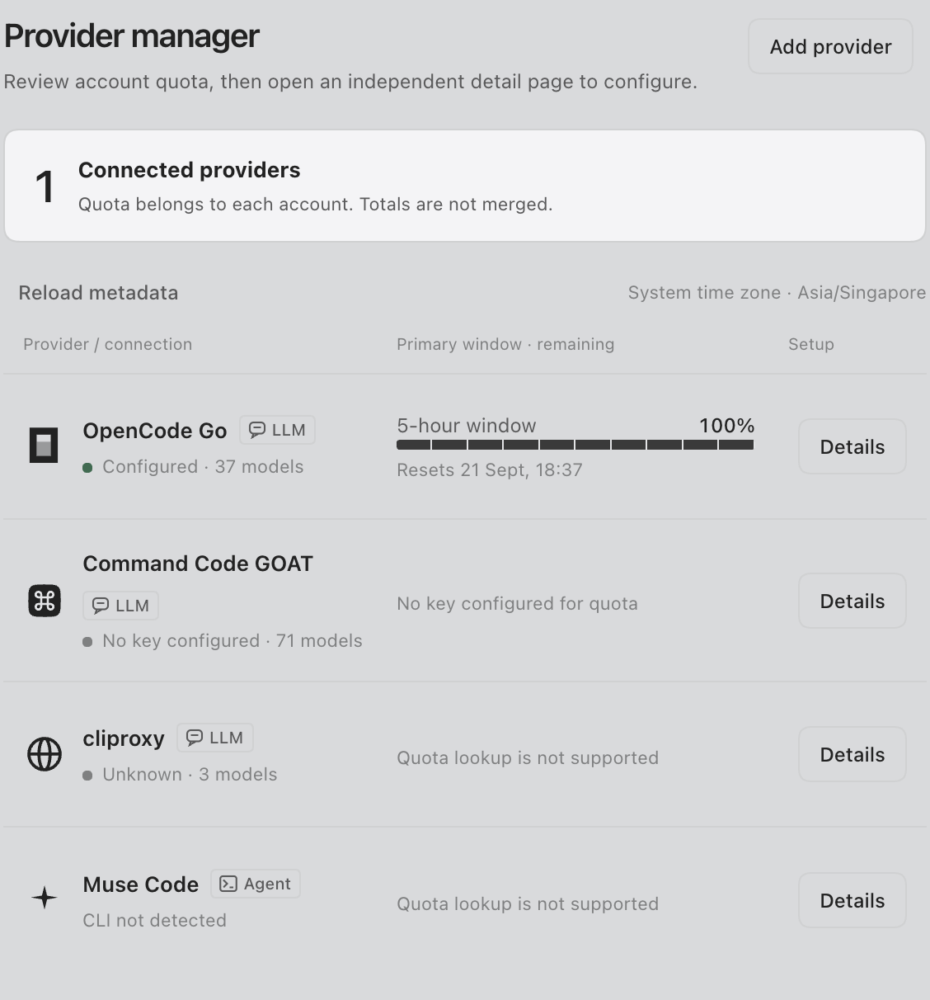
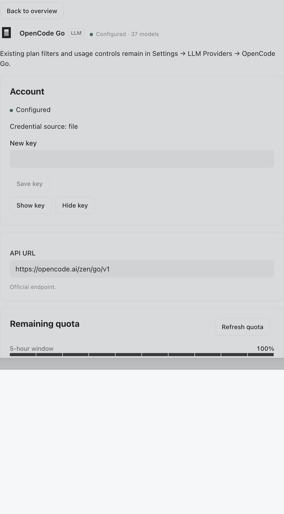
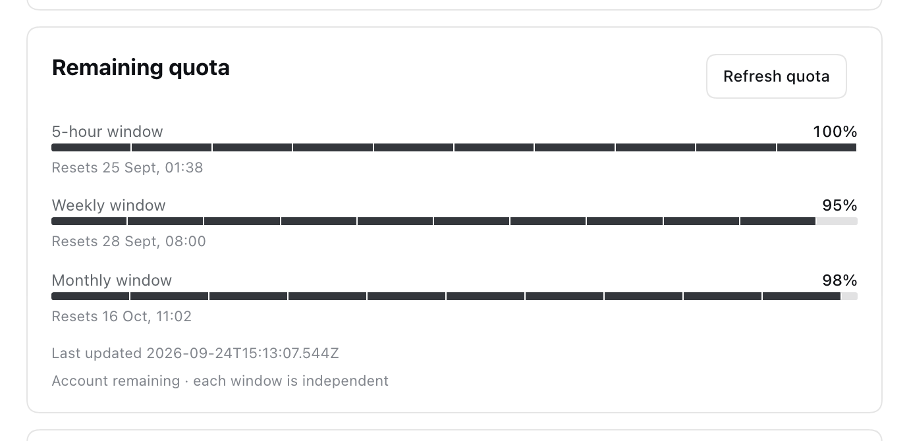
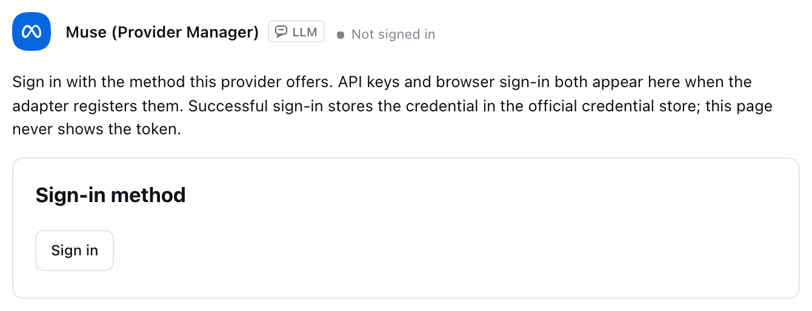
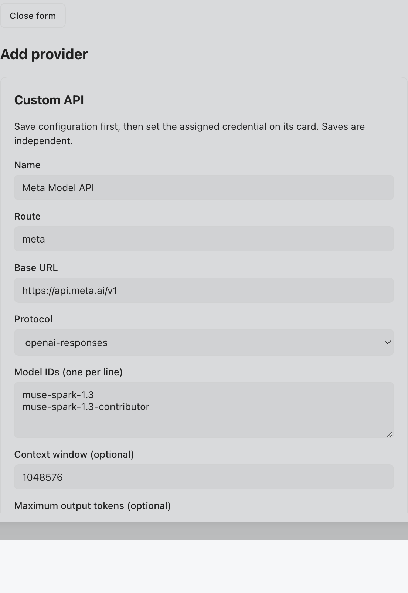

# dsh-provider-manager

**Every provider, one page.**

English | [中文](README.zh.md)

[](https://github.com/deepseek-ai/deepseek-harness)
[](LICENSE)

DeepSeek Harness promises *everything is a plugin*. This plugin finishes the sentence for providers: **every provider you can use in DSH — subscription sign-ins, public API keys, private gateways — lives on one Settings page**, from credential to quota to the models in your picker.

Two families, one ledger:

- **OAuth sign-ins** — Codex, Claude, Kimi, xAI, Copilot, OpenRouter, Muse. Sign in once; verified models with real parameters land in the model picker by themselves.
- **LLM providers (API-key)** — OpenCode Go with a built-in adapter, Command Code GOAT, 16 prefilled presets, and any custom gateway.

Verified on **DSH `0.1.5-rc.2`**. Current release: **v0.4.0**.

## OAuth sign-ins — sign in, and the models just appear

| | |
| --- | --- |
| **Providers** | Codex, Claude, Kimi, xAI, GitHub Copilot, OpenRouter, and every other catalog provider with a login method (39 flows on a stock install), plus an unofficial **Muse** device-code sign-in (bring your own subscription; the client id is the public Muse CLI value) |
| **The flow** | Official OAuth / device-code flows through the harness authorization service — which this plugin mounts, because the stock patch tree never does. Sign-in works out of the box |
| **After sign-in** | The provider's **verified-available** models are injected into the model picker with per-model context windows, output caps, official display names, and effort levels (`off / low / medium / high / xhigh / max` as the channel supports). Retired models never appear |
| **Card** | Brand mark, signed-in account, live quota where the provider exposes an endpoint (60-min auto + manual refresh), one-click logout, "will overwrite existing sign-in" guard |
| **Filter** | **ALL \| LLM \| OAuth** tabs; credentials land in the official store and tokens are never echoed |

### How the model list stays true

Channel reality is **probed, not assumed**: signing in triggers a lightweight verification (batch of 8, 24-hour per-model cooldown, never carries output caps) that reads the **served model** from each response — immune to silent upstream substitution. Results are recorded per model as `available`, `unavailable` (probed and rejected), or `unverified` (never enters the picker), with parameters cross-checked against [models.dev](https://models.dev). Availability ships from a separately versioned registry — [dsh-provider-models](https://github.com/KEVINCHEN625/dsh-provider-models) (dual mirrors, TTL refresh, bundled snapshot fallback); probe results persist locally and override the registry per model. The channel tier the harness calls `off` maps to the channel wire value `none` where probes confirmed it. OpenRouter stays tractable with a curated top-N seed (free tier + newest + allowlist, cap 50) plus **pick-from-catalog** additions that survive managed rewrites.

## LLM providers — one card per key

- **OpenCode Go, built in.** The `provider-manager-opencode-go` connection serves the official Go catalog (41 models — 31 callable today, 9 blocked until their protocol is verified, formal Muse Spark 1.3 on Zen with `max` effort) with per-model protocol selection, the sticky `x-opencode-session` header, and live-table catalog refresh. No third-party Go plugin required. [Setup, limits, rollback](docs/opencode-integrated.md) · [Catalog evidence](docs/opencode-all-models-evidence.md)
- **Command Code GOAT** — default-key editing plus official quota from `GET https://api.commandcode.ai/alpha/billing/credits` (only when the default credential is unambiguous; chat runs on the [Command Code provider plugin](https://github.com/Mars-Sea/dsh-commandcode-provider)).
- **Real quota, Host-only, from official endpoints.** OpenCode Go reads `GET https://opencode.ai/zen/go/v1/usage`. Custom endpoints show **unsupported**, never a fake 100% bar. Accounts are never merged.
- **16 prefilled presets, one card each.** **ZCode** (GLM Coding Plan, China / Overseas, Anthropic on the same card), **MiMo** (Xiaomi Token Plan `tp-` keys, China / Singapore / Europe), **MiniMax** (China / Overseas, Anthropic on the same card), plus **OpenRouter, SiliconFlow, Moonshot, DeepSeek, OpenAI, Anthropic, Groq, Together, Fireworks, DashScope, Google Gemini, Mistral** — and one-click **Meta Model API** (pay-as-you-go, not a Muse subscription). OpenRouter appears on both sides: API-key card here, OAuth card above.
- **Custom routes for everything else.** Any OpenAI-Completions, OpenAI-Responses, or Anthropic-Messages endpoint becomes a first-class route (`^[a-z][a-z0-9-]*$`), with reserved-name protection so you can never shadow `opencode-go`, `commandcode`, `deepseek-official`, or `cliproxy`.
- **Per-model 1M context.** Every addable model carries a **1M context** checkbox, prefilled to official sizes (GLM-5.3 / Flash / 5.2, MiMo V2.5, MiniMax-M3, Gemini 2.5 Flash, GPT-4.1 mini, Muse Spark = 1M; GLM-5-Turbo = 200K; MiniMax-M2.7 = 204,800). Tick or untick before save.

## Screenshots

Settings → **Provider manager** — remaining quota on the list, details one click away:



OpenCode Go details — write the default key; Host reads 5-hour / weekly / monthly remaining:





Muse — device-code sign-in plus the Meta Model API fallback:



One-click Meta Model API draft (`openai-responses` at `https://api.meta.ai/v1`):



## Install

This package declares `dsh.bundle`, so `dsh plugin add` activates a settings layer. Official notes: [Package and install a plugin](https://deepseek-harness.github.io/deepseek-harness/en/develop/basic/publish).

Install the **release tarball** (it already contains `lib/`). We do not ship a `prepare` script, so `github:KEVINCHEN625/dsh-provider-manager` will not compile on install — this plugin handles credentials and should not require `allowBuilds`.

```sh
dsh plugin --profile web add --ignore-scripts --force \
  https://github.com/KEVINCHEN625/dsh-provider-manager/releases/download/v0.4.0/dsh-provider-manager-0.4.0-664a895a3f1b.tgz
dsh --profile web --dump-config   # look for "# == dsh-provider-manager"
dsh web
```

Then open **Settings → Provider manager**. Check [Releases](https://github.com/KEVINCHEN625/dsh-provider-manager/releases) for the latest tarball and swap the URL.

If the web profile is itself a pnpm workspace (`packages: [.]`), pass pnpm's boolean `--workspace-root` **before** the tarball:

```sh
dsh plugin --profile web add --workspace-root --ignore-scripts --force \
  ./dsh-provider-manager-0.4.0-664a895a3f1b.tgz
```

CLI success and a live page are separate checks. Restart Web after adding the plugin.

### Which adapter runs the chat

| Provider | Chat runs on |
| --- | --- |
| OpenCode Go / Spark | **Built in** — `provider-manager-opencode-go`, no third-party plugin required |
| Muse | **Built in** — `provider-manager-muse` after a device-code sign-in (5 models; only Spark 1.3 carries `max`) |
| Command Code GOAT | [Command Code provider plugin](https://github.com/Mars-Sea/dsh-commandcode-provider) |
| OAuth sign-ins (Codex, Claude, …) | The harness `llm-pi-ai` route named after the provider |
| Custom gateways | The `llm-pi-ai` custom route you created |

## Using the page

The list shows brand mark, name, LLM/Agent badge, key status, primary remaining window, Details.

**OpenCode Go** — default ref `OPENCODE_API_KEY`. Quota from the official usage endpoint. Unofficial base URLs: quota unsupported.

**Command Code GOAT** — default ref `COMMANDCODE_API_KEY` only. Literal keys, extra accounts, and `auth.json` may take precedence; this page does not read login files. Ambiguous sources show **source-unverified** instead of a fake bar.

**Custom API** — `llm-pi-ai` route. **Add provider** starts from a known API when one matches. ZCode, MiMo, MiniMax, SiliconFlow, and Moonshot stay on **one card**: choose **China** or **Overseas**, then save. The key must match the console that issued it.

| Preset | Notes |
| --- | --- |
| **ZCode** | GLM Coding Plan (`glm-5.3-flash`, `glm-5.3`). China `https://open.bigmodel.cn/api/coding/paas/v4`, Overseas `https://api.z.ai/api/coding/paas/v4`. Anthropic Messages uses `/api/anthropic`. Do **not** use `/api/paas/v4`. |
| **MiMo** | Xiaomi Token Plan (`tp-` keys, not pay-as-you-go `sk-`). China `https://token-plan-cn.xiaomimimo.com/v1`, Overseas Singapore `https://token-plan-sgp.xiaomimimo.com/v1`. Europe cluster is `token-plan-ams` — paste it if that is what the Token Plan page shows. |
| **MiniMax** | China `https://api.minimax.cn/v1`, Overseas `https://api.minimax.io/v1`. Anthropic uses `/anthropic` on the same card. |
| **OpenRouter** | `https://openrouter.ai/api/v1` |
| SiliconFlow / Moonshot | China and Overseas URLs on the same card |
| DeepSeek, OpenAI, Anthropic, Groq, Together, Fireworks, DashScope, Google Gemini, Mistral, Meta Model API | Official base URL prefilled |

Save configuration first, then save the key. Each model row can tick **1M context**; that writes `models[].contextWindow` for `llm-pi-ai` (1,048,576 when ticked, or the model's listed size when not). The env name is derived from the route (`DSH_PROVIDER_MANAGER_<hex(route)>_API_KEY`). Quota lookup is **unsupported** for these endpoints. Reserved routes: `opencode-go`, `commandcode`, `deepseek-official`, `cliproxy`, `muse-code`, `provider-manager-opencode-go`, `provider-manager-muse`.

## Security

- RPC and snapshots never echo key material.
- Reveal requires an authenticated same-origin POST from a **real loopback socket** — proxies, tunnels, and `Origin: null` are rejected.
- Revealed values clear on hide, back, blur, connection change, and TTL (max 30s).
- Quota fetches and channel probes send credentials only to the official provider endpoints; probes never carry output caps and run at most once per model per 24 hours.

Remote browsers need SSH forwarding to `127.0.0.1` to persist settings or reveal a key.

## Roadmap — closing the last miles to "everything"

1. **Channel data for every family** — each provider's seed lands as its users sign in and probe; the registry accumulates verified truth per channel.
2. **Key health check on save** — verify a freshly pasted key against the provider before you trust the card.
3. **Multi-account** — per-provider key pools with rotation, for plans that allow it.
4. **More quota adapters** — the same official-endpoint ledger for the sign-in families.

## Uninstall

```sh
dsh plugin --profile web remove dsh-provider-manager
dsh web
```

Removing this bundle removes its built-in `provider-manager-opencode-go` and `provider-manager-muse` connections. Credentials, custom `llm-pi-ai` routes, and separately installed provider plugins remain. Select a remaining provider before resuming sessions that used a built-in route.

## Develop

```sh
pnpm install --frozen-lockfile
pnpm typecheck && pnpm test && pnpm test:client
pnpm build && pnpm check:pack
```

Design, deployment evidence, and the review trail live in [`docs/`](docs/). The plugin touches only published dsh services — `settings`, `credentials`, `llm` — and never patches the harness or other plugins.

## Trademarks

Brand marks on the cards come from [simple-icons](https://simpleicons.org) where that library has one. OpenAI, Groq, Amazon Bedrock, Azure, Cerebras, Fireworks, Together, Baseten, Z.ai, Ant Group, and Pi are the vendors' own published marks, embedded the same way. Each mark is a trademark of its owner and is shown only to identify the provider. A provider with no mark keeps the letter badge.

## License

[MIT](LICENSE)
